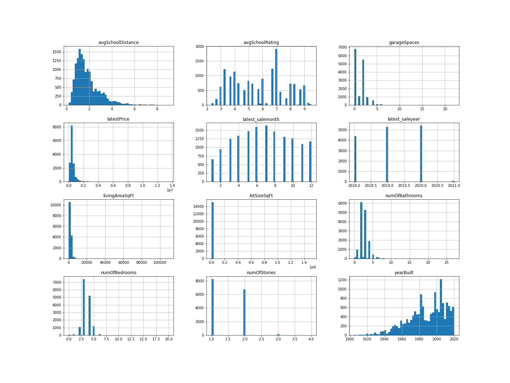
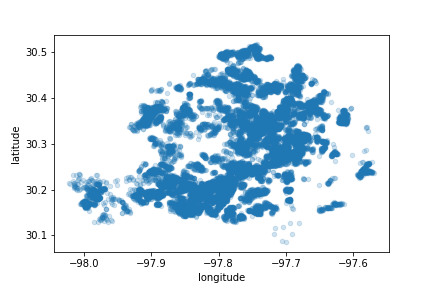
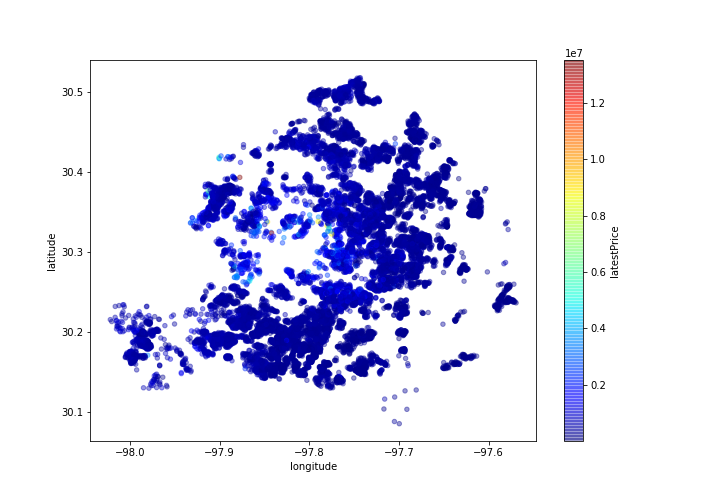

# Project-3

# Project Name
> This tool allows users to calculate how much their dream home in Austin, TX might cost.  
>
> You can access our website [_here_](https://www.example.com). <!-- If you have the project hosted somewhere, include the link here. -->

## Table of Contents
* [General Info](#general-information)
* [Technologies Used](#technologies-used)
* [Data](#data)
* [Machine Learning](#machine-learning)
* [Setup](#setup)
* [Usage](#usage)
* [Project Status](#project-status)
* [Room for Improvement](#room-for-improvement)
* [Acknowledgements](#acknowledgements)
<!-- * [License](#license) -->

## General Information
> The City of Austin recently conducted  a [study](https://austintexas.gov/sites/default/files/files/Housing/Austin%20HMA_final.pdf) with Root Policy Research which noted that Austin's median home value rose 55% from 2010. While Austin is considered affordable when compared with cities in California or the Pacific Northwest, a 55% increase in house price is notable. Our aim was to create a tool that would allow potential homebuyers to better understand the cost of a home in Austin depending on the size of home that best suits their needs. 

## Technologies Used
- Python Pandas 
- HTML/CSS/Bootstrap/Seaborn
- Tableau
- Machine Learning 
- Scikit-Learn
- Joblib

## Data
> We found a [dataset from Kaggle](https://www.kaggle.com/ericpierce/austinhousingprices) that contained 2021 housing data from Austin. The data inclued over 45 features which provided our team a solid foundation for data analysis around housing information in Austin. 
>
> For the initial analysis of our data, we create several plots for variables we were curious to learn more about which can be seen below:

> We also created some initial renderings of our property's location using latitude and longitude and the location correlated with the price. 

## Machine Learning

<!-- If you have screenshots you'd like to share, include them here. -->

## Setup
What are the project requirements/dependencies? Where are they listed? A requirements.txt or a Pipfile.lock file perhaps? Where is it located?

Proceed to describe how to install / setup one's local environment / get started with the project.

## Usage
How does one go about using it?
Provide various use cases and code examples here.

`write-your-code-here`

## Project Status
Project is: _in progress_ / _complete_ / _no longer being worked on_. If you are no longer working on it, provide reasons why.

## Room for Improvement
Include areas you believe need improvement / could be improved. Also add TODOs for future development.

Room for improvement:
- Improvement to be done 1
- Improvement to be done 2

To do:
- Feature to be added 1
- Feature to be added 2

## Acknowledgements
Give credit here.
- This project was inspired by...
- This project was based on [this tutorial](https://www.example.com).
- Many thanks to...

