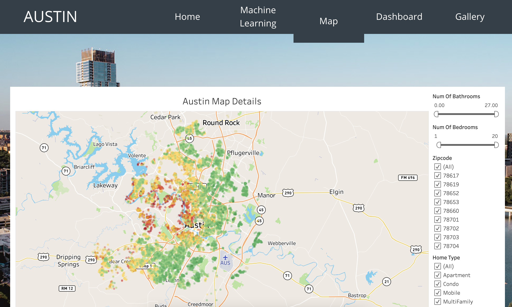

# Project-3

# Project Name
> This tool allows users to calculate how much their dream home in Austin, TX might cost based on number of bedrooms, bathrooms, total square footage, and year of the home.  
>
> You can access our website [_here_](https://www.example.com). <!-- If you have the project hosted somewhere, include the link here. -->

## Table of Contents
* [General Info](#general-information)
* [Technologies Used](#technologies-used)
* [Data](#data)
* [Machine Learning](#machine-learning)
* [Webpage](#webpage)
* [Project Status](#project-status)
<!-- * [License](#license) -->

## General Information
> The City of Austin recently conducted  a [study](https://austintexas.gov/sites/default/files/files/Housing/Austin%20HMA_final.pdf) with Root Policy Research which noted that Austin's median home value rose 55% from 2010. While Austin is considered affordable when compared with cities in California or the Pacific Northwest, a 55% increase in house price is notable. Our aim was to create a tool that would allow potential homebuyers to better understand the cost of a home in Austin depending on the size of home that best suits their needs. 

## Technologies Used
- Python Pandas 
- HTML/CSS/Bootstrap/Seaborn
- Tableau
- Machine Learning 
- Scikit-Learn
- Joblib

## Data
> We found a [dataset from Kaggle](https://www.kaggle.com/ericpierce/austinhousingprices) that contained 2021 housing data from Austin. The data inclued over 45 features which provided our team a solid foundation for data analysis around housing information in Austin. 
>
> For the initial analysis of our data, we create several plots for variables we were curious to learn more about which can be seen below:

> We also created some initial renderings of our property's location using latitude and longitude and the location correlated with the price. 

> In addition, we created a correlation matrix to determine which variables have the highest correlation to sale price so we could use those to create our machine learning model. 

## Machine Learning

For our machine learning code, we utilized a simple linear regression with the train, test, split model. 

`model.fit(X_train, y_train)`
`training_score = model.score(X_train, y_train)`
`testing_score = model.score(X_test, y_test)`

While a linear regression is the best model for this type of question our outcomes were not ideal. Our training score was 0.361 and our test score was 0.297. 

## Webpage
> To compile all our work, we created a web interface with pages as described and shown below:
#### A landing page with an overview of Austin.

#### A machine learning page where users can predict what they will pay for a home depending on the features they choose. 

#### A map with all the locations of properties within our dataset and a pop up that includes the address, number of bedrooms, bathrooms, and square footage. 

#### A dashboard with basic data analysis for the noted variables. 

#### A gallery with a variety of homes in Austin for buyers better understand the style of homes in Austin.

## Project Status
Project is: _in progress_ 

